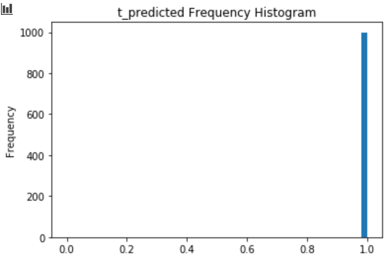

### Data set 

  - MNIST (noise MNIST, origin MNIST) 

### Use Models 

  - Discriminator(DCGAN), Unet
  - MNIST Train


### Image 시각화

  - input Image (noise MNIST)
  - Origin MNIST  
  - Generated Image (UNET)
  - Anomaly Image (diff = noise - Generated)


### Discriminated 검증

```python 
dicriminated = disc_model.predict(generated)
```
  -   - 1 : Real, 0 : fake

